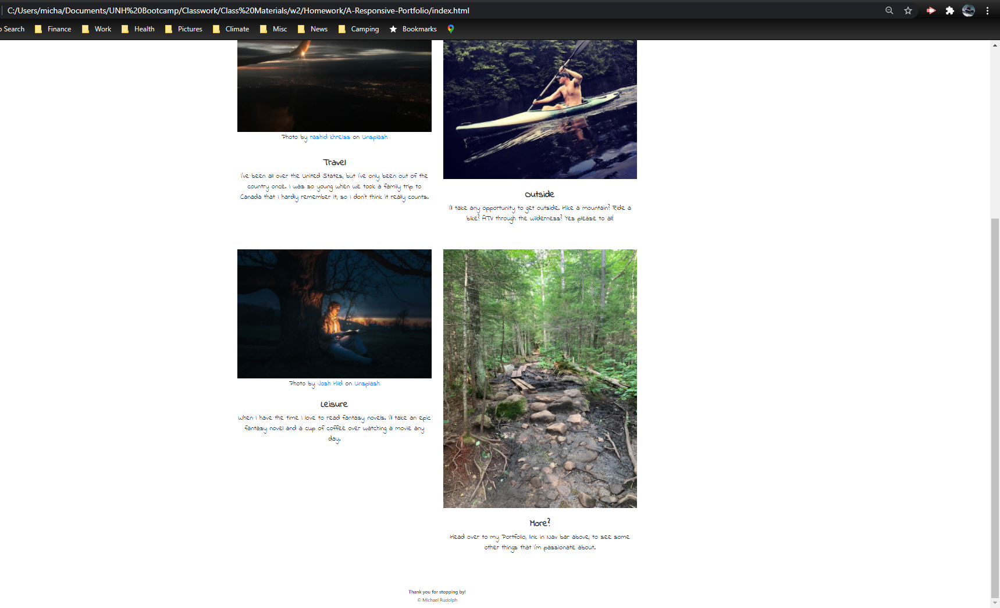

# Project: CSS and Bootstrap: Responsive Portfolio

  Deployable Link - > https://reindeercode.github.io/A-Responsive-Portfolio/

## Table of Contents: 
- [Project: CSS and Bootstrap: Responsive Portfolio](#project-css-and-bootstrap-responsive-portfolio)
  - [Table of Contents:](#table-of-contents)
  - [License:](#license)
  - [Description:](#description)
  - [Images:](#images)
  - [Installation Instructions:](#installation-instructions)
  - [Test Command:](#test-command)
  - [Github:](#github)
  - [My Email Address:](#my-email-address)
  - [Other Contributors:](#other-contributors)

## License:

## Description:
Use the Bootstrap CSS Framework to create a mobile responsive portfolio.

## Images:

## Installation Instructions: 
No requirments to install project. If creating your own ensure that you have links to the most recent Bootstrap in your HTML.

## Test Command: 
To test type Simply click the deployed site link. into the terminal

## Github: 
Check out more projects on my Github at https://github.com/ReindeerCode

## My Email Address:
If you have any questions please feel free to email me at ReindeerCode@gmail.com

## Other Contributors:
None at this time.
